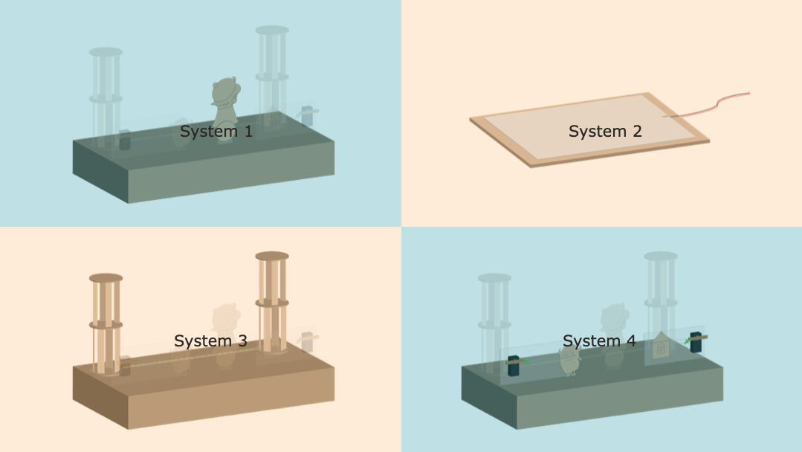
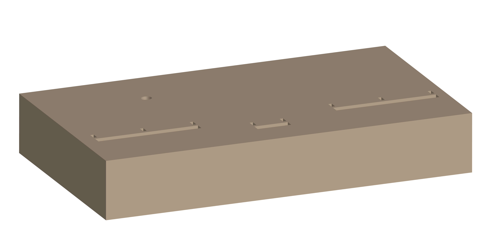
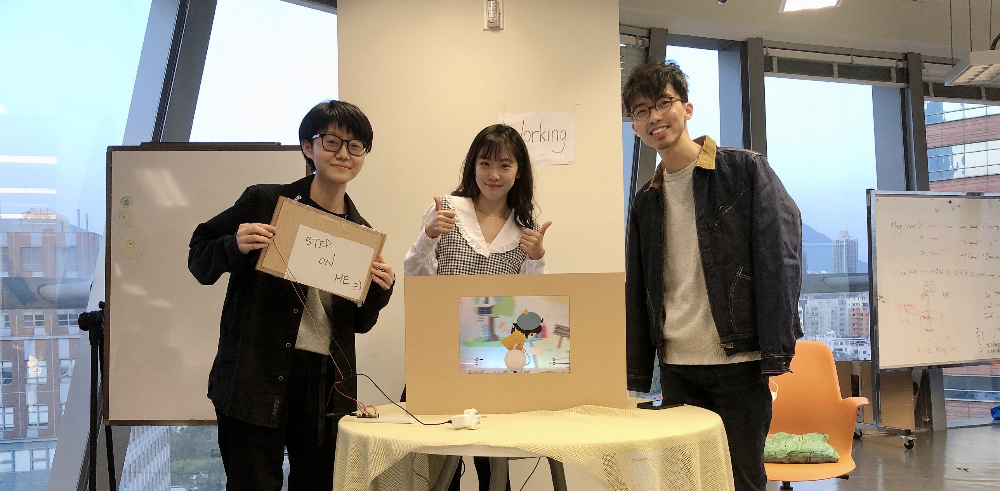

# SD5524 Tangible Interaction Workshop
This is an interaction stage installation that reflecting the hustle of a place/ city with the measure of steps. The design is a composition of 4 different systems which responding to different functionalities of the design.


## Design
### Why using modular design?

We intensionally to break our design into different small systems with the following concerns:
- Allow agile development
- Easier to get every team members invloved
- Easier for repairing and scaling up
- Aovid single point of failure

## General guidelines
### guideline on setting up the ESP8266
Please update the first few lines of code to fit your setting on every `.ino`.
Be aware the ESP8266 cannot connect to network that requiring extra sercurity measure (like PolyUWLAN). You may need to use your mobile hotspot or using a router with LAN connection as AP for the purpose.
```C
String clientId = "YOUR_DEVICE_ID"; // --> Define your client ID is string, be aware NOT to have duplicated ID

// Update these with values suitable for your network.

const char* ssid = "YOUR_SSID";
const char* password = "YOUR_WIFI_PASSWORD";
const char* mqtt_server = "YOUR_MQTT_BROKER";
```
### guideline on setting up MQTT
#### Platform
You can definitely to use any public MQTT brokers for the project, but for avoiding interfere with other users on the broker platform it would be advised to host your whole MQTT broker or using manged MQTT serivce like [shiftr.io](shiftr.io). 

For connecting to MQTT broker with access control from ESP 8266, you can modify the connection function in `.ino` file as below:

With access control
```C++
void reconnect() {
//... rest of the code
if (client.connect(clientId.c_str(),"YOUR_USER_NAME_HERE","YOUR_PASSWORD_HERE")) {
    //...

    }
// ... rest of the code
}
```

Without access control
```C++
void reconnect() {
//... rest of the code
if (client.connect(clientId.c_str())) {
    //...

    }
// ... rest of the code
}
```
#### Topic schema
General topic header (tHeader) `sd5524/{group_number}`
| Topic purpose | pub/sub? (from Core prespective)) | URI |
| :------- | :--------: | :---: |
|  Topic for all system status | sub | `{tHeader}/status` |
| Topic for specific device/ system status |sub | `{tHeader}/device/{deviceId}/status`|
|Topic for system specific controls* | pub | `{tHeader}/device/{deviceId}/{specificControlsURI}`

**For topic for system specific controls, please refer to the system pages*

### guideline on using L298N

For details, you can reference [here](https://howtomechatronics.com/tutorials/arduino/arduino-dc-motor-control-tutorial-l298n-pwm-h-bridge/)
Few points to share on using L298N:
- Remeber to provide power to the board in the 5V regulator jumper is applied, else this will lead to insufficient power output for the motor controller
- It recommanded to used standalone power source for powering the motors
- PWM is used for speed controlling, be aware if the pin on the controller board is supported.
### Stage set up

Material: **3mm MDF**

File: [download](./resources/Stage&Characters.ai)



### Over all setup guide
Follow the instruction as following orders:

1. The stage
2. [Core](./core/readme.md)
3. [System 1](./system1_character/readme.md)
4. [System 2](./system2_input/readme.md)
5. [System 3](./system3_backdrop/readme.md)
6. [System 4](./system4_supporting/readme.md)
7. Test the overall system


### System details
For each details, plese refer the specific system pages
- [System 1](./system1_character/readme.md)
- [System 2](./system2_input/readme.md)
- [System 3](./system3_backdrop/readme.md)
- [System 4](./system4_supporting/readme.md)

## Special thanks
We are very thankful for the supports and leatures from Dr. Clifford Choy and his team (Tim and Henry)

