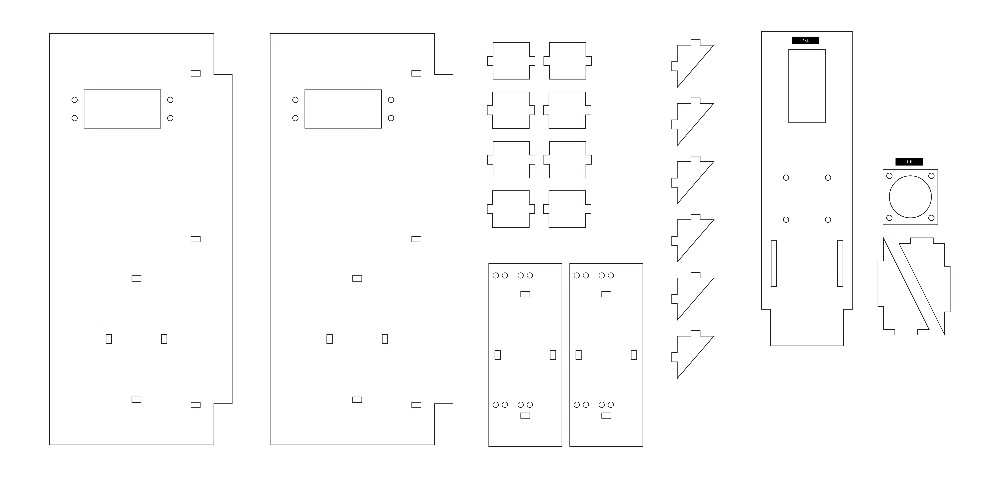
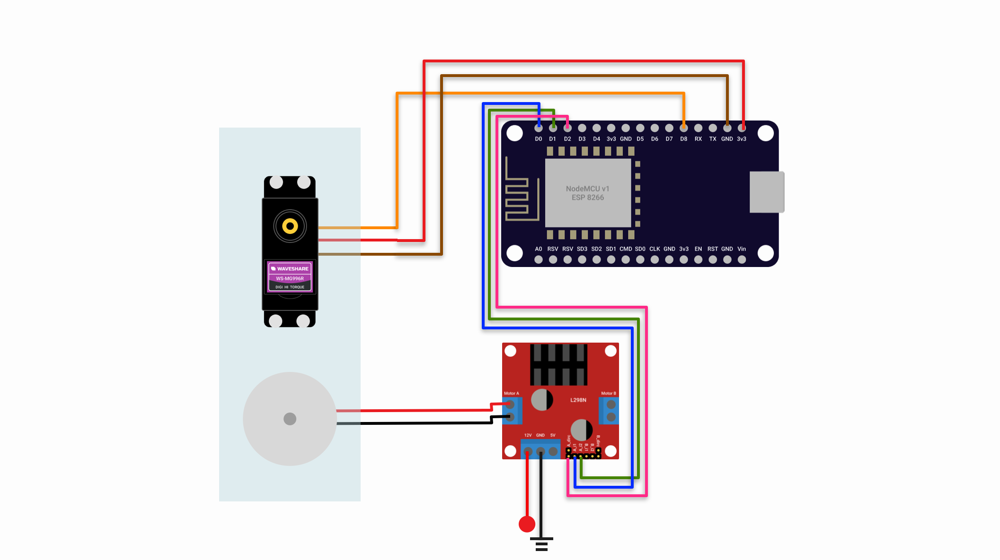

# System 1: The Character

## Descpription
Et dolores ut et dolor diam sanctus clita, lorem diam sed gubergren tempor kasd. Elitr consetetur sit lorem ea no,.Ea et stet eos diam ipsum et sea dolores et sanctus. Amet dolore et eos at duo accusam takimata invidunt, ipsum amet takimata nonumy diam consetetur, et lorem tempor sed sea accusam at, aliquyam dolores ipsum dolor gubergren sea dolor, sadipscing et invidunt diam invidunt at stet magna, lorem diam.

## Materials and resources
### Electronics
| Item | ID (if any) | Qualities | Purpose | Where to get |
| ---- | :-----------: | :---------: | ------- | ------------ |
| 180 Servo motor | 996N | 1 | Control the inclination of the character | [Taobao]() |
| Small DC motor (from kit) | / | 1 | For the motor of the character feet | [Taobao]() |
| NodeMCU v1 | ESP 8266 | 1 | Controlling the hardwares with wireless compability
| DC Motor shield | L298N | 1 (_share use with system 3_) | Allow speed control and direction control for 2 DC motors | [Taobao]()

### Laser cut 

**3mm clear acrylic**

### Steps to assemble
1. Put the Servo motor though the rectagular opening on parts _1-a_, fix the servo motor with 3mm screws and nuts
2. Mount the small DC motor on the motor mounting plate (parts _1-b_), apply glue if needed
3. Put the motor mounting plate on the _1-a_ with screws
4. Make sure all the wires are running at the back of _1-a_ and long enough to run though the opening on the stage, extend the wires if needed
5. Test the system by deploying the code and controls as below

## Wiring

| pin (ESP 82866) | Connection |
| --- | ---------- |
| D8 | Servo motor signal (Orange) |
| D0 | Motor A signal pin 1 (L298N) |
| D1 | Motor A signal pin 1 (L298N) |
| D2 | Motor A Speed control pin (L298N) _* need to remove the jumper_ |

## Software
For details, please reference to the comments in [sys1.ino](sys1/sys1.ino). For the first time deploy, please be remained to update the Wifi connection, Device ID and MQTT broker endpoint.
### Controls (subcribing)
1. Turn the character to an angle value : `{device_id}/turn`

    #### payload 
    - servoId: Integer ( 0 - 8 )
    - angle: Integer (0 - 180 )

    #### example
    ```JSON
    {
      "servoId": 0,
      "angle": 90 
     }
    ```
2. To make the character run : `{device_id}/run`
   
    #### payload
      - speed: Integer ( 0 - 1023, default= 550 ) 
      - isClockwise: BOOL (default= true)

    #### example payload
    ```JSON
    // To set the motor 0 with speed 500 in clockwise
    {
      "motorId": 0,
      "speed": 500,
      "isClockwise": true
    }
    ```

