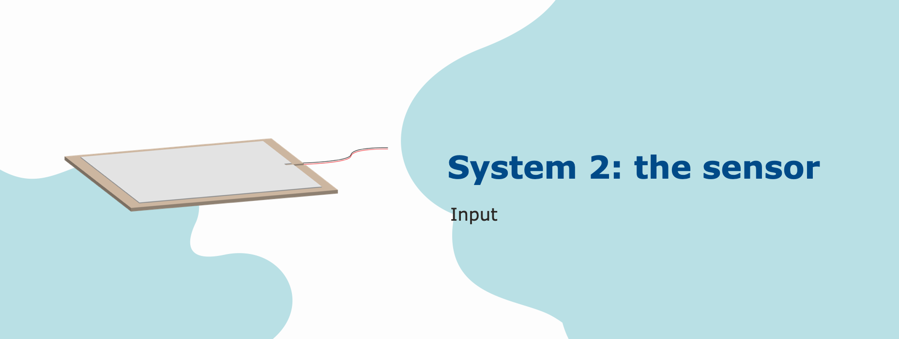
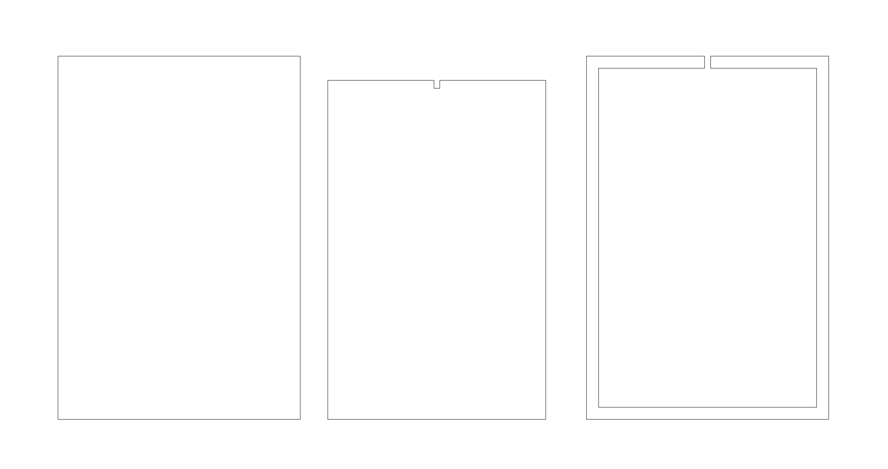
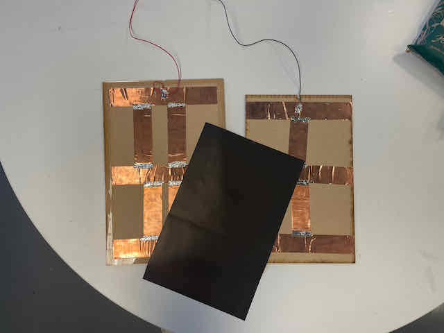
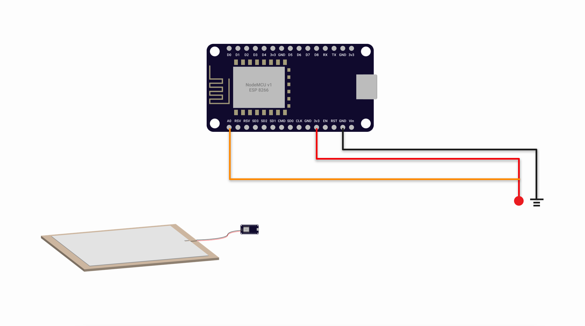

# System 2: The sensor

## Descpription
Et dolores ut et dolor diam sanctus clita, lorem diam sed gubergren tempor kasd. Elitr consetetur sit lorem ea no,.Ea et stet eos diam ipsum et sea dolores et sanctus. Amet dolore et eos at duo accusam takimata invidunt, ipsum amet takimata nonumy diam consetetur, et lorem tempor sed sea accusam at, aliquyam dolores ipsum dolor gubergren sea dolor, sadipscing et invidunt diam invidunt at stet magna, lorem diam.

## Materials and resources

! The below listing and steps are for 1 sensor ONLY, please adjust the quantity
### Electronics
| Item | ID (if any) | Quantities | Purpose | Where to get |
| ---- | :-----------: | :---------: | ------- | ------------ |
| NodeMCU v1 | ESP 8266 | 1 | Controlling the hardwares with wireless compability | [taobao](https://detail.tmall.com/item.htm?spm=a230r.1.14.16.116e67dflXKZax&id=606082163513&ns=1&abbucket=18&skuId=4481432642490)
| Pressure-Sensitive Conductive Sheet  | Velostat | 1 | Allow speed control and direction control for 2 DC motors | [adafruit](https://www.adafruit.com/product/1361)
| Copper tape | / | - | To provide a conductive surface for the pannels | [taobao](https://detail.tmall.com/item.htm?spm=a220m.1000858.1000725.13.508110b0yQwuRF&id=554815407207&skuId=3419301857637&user_id=3343070286&cat_id=2&is_b=1&rn=2e77011a3ec6fa32a9756dfe098100ac)

### Laser cut 


**3mm clear acrylic** ,**3mm MDF board**

### Steps to assemble
1. Apply copper tape on the inner side of sensor plate, solder the connection points of the tapes to make sure they are all connected 
2. Cut out the velostat to fit the slot (_stack up the velostat may enhance the sensitivity_)
3. Put the velostat in the middle of the conductive layer
5. Wire up the system
6. Test the system by deploying the code and controls as below

## Wiring

| pin (ESP 82866) | Connection |
| --- | ---------- |
| A0 | Any point of the live wire of the system |
| 3.3V |  One side of the conductive layer |
| GND | Another side of the conductive layer |

## Software

### Way to determine status
| Status | payload msg | Description | Rules |
| ------ | ----------- | ----------- | ----- |
| A step is detected| `pressed` | User walked a step on the sensor plate (aka a force is applied on the sensor) | by comparing the the `sensorValue` with the `pastSensorValue`, if the difference is greater than `sensitivty`, a signal will be emitted
| Standing | `stopped` | User is standing on the sensor plate | the `sensorValue` !== `refValue` and remain in a buffer range for more than 5s
| Idle | `empty` | No user is on the sensor plate | the `sensorValue` == `refValue` for more than 5s


For details, please reference to the comments in [sys2.ino](sys2/sys2.ino). For the first time deploy, please be remained to update the Wifi connection, Device ID and MQTT broker endpoint.
### Controls (Emitting)

The system will emit differnt type of payload based on the sensors' status on the topic `{device_id}/status`
#### Standing example
```JSON
{
    "id": "sys2_1",
    "msg": "stopped",
    "standingCounter": 6618 
}
```
#### Pressed example
```JSON
{
    "id": "sys2_1",
    "msg": "pressed",
    "delta": 1011,
    "sinceSys": 10012602
}
```
#### Idle example
```JSON
{
    "id": "sys2_1",
    "msg": "empty",
    "emptyCounter": 6655  
}
```