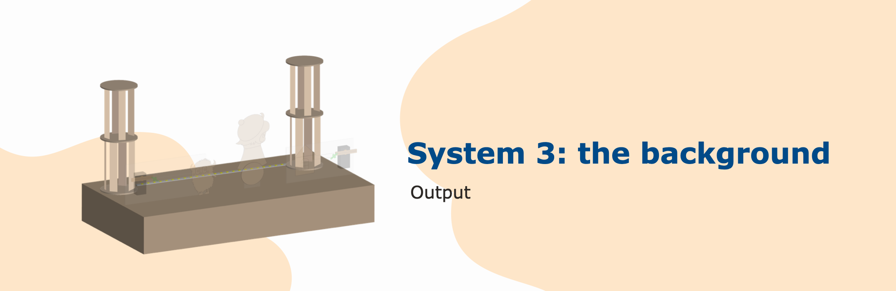
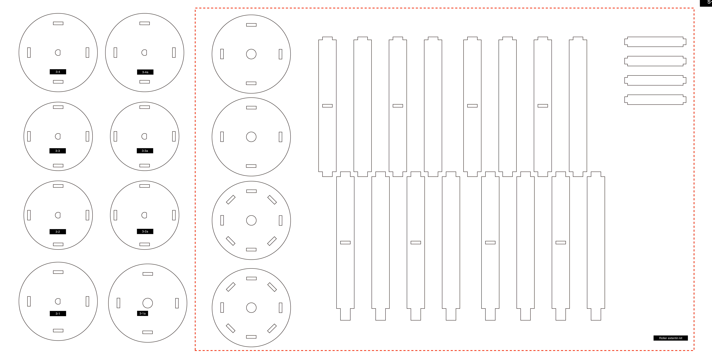
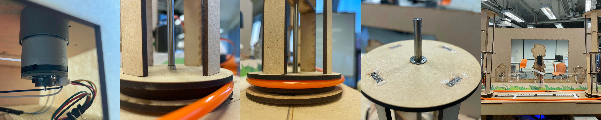
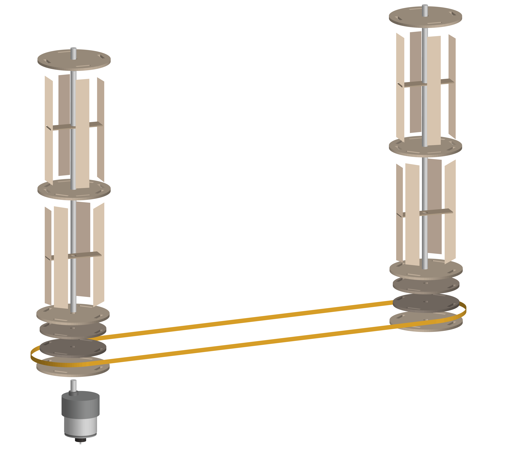
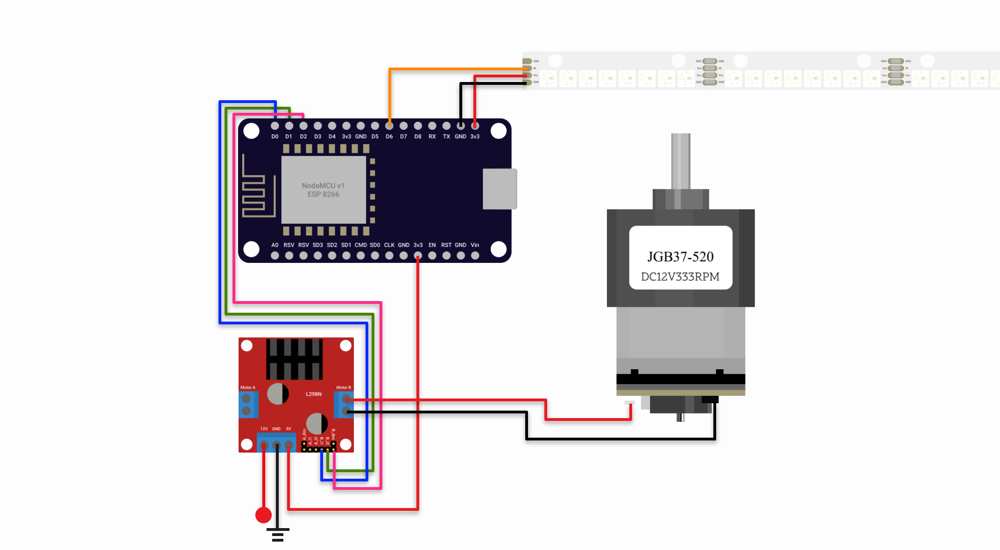

# System 3: the backgorund

## Descpription

The background represents the scenery on the road, aiming to provide a positive output that can bring an enjoyable visual experience to users. And we put a pixel inside the background as an environment light, from dark to light, to represent the hustle state.

[NEO Pixel Doc](https://adafruit.github.io/Adafruit_NeoPixel/html/class_adafruit___neo_pixel.html#a74e917093c2eb16848c4a09427680f79)

## Materials and resources
### Electronics and parts
| Item | ID (if any) | Quantities | Purpose | Where to get |
| ---- | :-----------: | :---------: | ------- | ------------ |
| Stepped down DC motor | JGB37-520 | 1 | Driving the background roller | [Taobao](https://item.taobao.com/item.htm?spm=a312a.7700824.w4002-23304424597.26.7e839d8aDol6Ct&id=581652733065) |
| NodeMCU v1 | ESP 8266 | 1 | Controlling the hardwares with wireless compability | [Taobao](https://detail.tmall.com/item.htm?spm=a230r.1.14.16.116e67dflXKZax&id=606082163513&ns=1&abbucket=18&skuId=4481432642490)
| DC Motor shield | L298N | 1 (_share use with system 1_) | Allow speed control and direction control for 2 DC motors | [Taobao](https://detail.tmall.com/item.htm?spm=a230r.1.14.23.53526f0dTKTMPP&id=18566053714&ns=1&abbucket=18)
| Small Deep Groove Ball Bearing | [MF105ZZ](https://us.misumi-ec.com/vona2/detail/221000531116/?HissuCode=MF105ZZ) | 3 | / | Lcoal store | 
| 5mm steel rod (or any 5mm rod can serve as axis) | / | 2 | Serve as axis for the background rollers | Lcoal store |
| Rubber band/ tube | / | ~ 1m (depends on the distance of two rollers) | as the connection belt for two rollers | local store

### Laser cut 

Material: **3mm MDF**
File: [download](./resources/Backdrop.ai)

### Steps to assemble
 
1. Install the motor under the stage platform though the opening _s-1_, fix it with screws
2. Insert one steel rod though the opening _s-2_, which should the center of the background roller without motor
3. Prepare the roller disk for the motor side (parts # 3-1,3-2,3-3,3-4), stack them up on the motor's axis as the image show
4. Prepare the roller disk for the **NON** motor side (parts # 3-1a,3-2a,3-3a,3-4a), install the bearing in the bottomest plate, stack them up though the steel rod as the image show
5. Fit on the rubber tube, test the motion by powering up the motor
6. If everything works, extend the height of the roller with the roller extention parts



7. Insert a bearing on the toppest plate for both roller, insert the steel rod though the bearing for the roller with the motor
8. Solder up the neo pixels to the length you wish, for our case is 4 units of panels with 32 LEDs (**Remeber to update the number of pixels in the code!**)
9.  Make sure all the wires are running though the opening of _1-a_ on the stage floor, extend the wires if needed
10. Put on the background
11. Test the system by deploying the code and controls as below



## Wiring

| pin (ESP 82866) | Connection |
| --- | ---------- |
| D6 | Neo Pixel IN pin |
| D0 | Motor B signal pin 1 (L298N) |
| D1 | Motor B signal pin 1 (L298N) |
| D2 | Motor B Speed control pin (L298N) _* need to remove the jumper_ |
| 3.3V |  Neo Pixel Vcc pin |
| 3.3V |  L298N 5V pin |
| GND | Neo Pixel GND pin |

## Software
For details, please reference to the comments in [sys3.ino](sys3/sys3.ino). For the first time deploy, please be remained to update the Wifi connection, Device ID and MQTT broker endpoint.
### Controls (subcribing)
1. Control the background roller : `{device_id}/turn`

    #### payload 
    - motorId: Integer ( 0 - 8 )
    - speed: Integer (0 - 1023 )
    - isClockwise: BOOL

    #### example payload
    ```JSON
    // To set the motor 0 with speed 500 in clockwise
    {
      "motorId": 0,
      "speed": 500,
      "isClockwise": true
    }
    ```
2. Control the background LED projection : `{device_id}/pixel/set`

    #### payload 
    - red: Integer ( 0 - 255 )
    - green: Integer ( 0 - 255 )
    - blue: Integer ( 0 - 255 )
    - brightness: Integer (0 - 100, optional)
    
    _To turn off the light, send a black color (0,0,0) as payload_

    #### example payload
    ```JSON
    // To turn the strip to pure red @ 75% brightness
    {
      "red":255, 
      "green":0, 
      "blue": 0,
      "brightness": 75

    }
    ```
3. Init and reset the total number of pixels : `{device_id}/pixel/init`


    #### payload
    - numOfPixels: Integer (optional)

    #### example payload
    ```JSON
    // To change the total number of pixels to 16
    {
      "numOfPixels": 16
    }
    ```