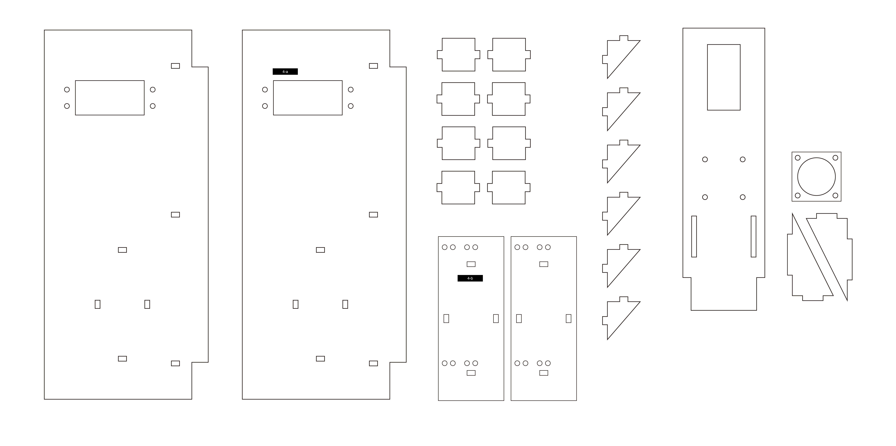
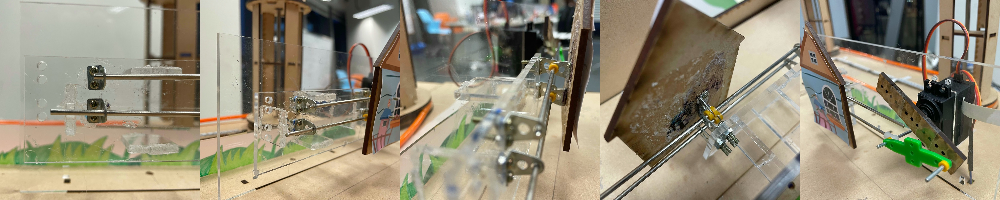
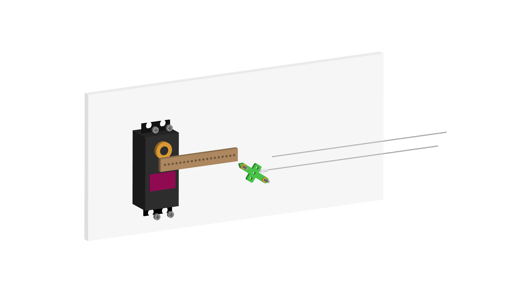
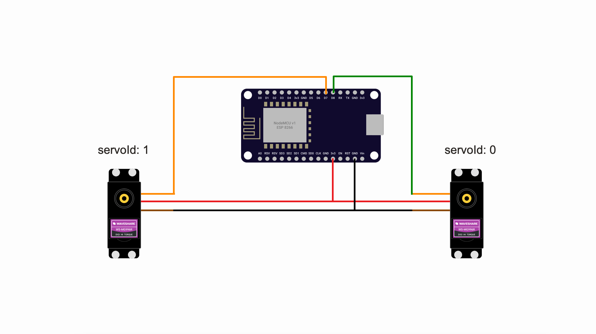

# System 4: the supporting

## Descpription
The supporting structure is divided into two sections, a monster, and a house. The monster will be pushed on the stage when lots of people pass through the input sensor, which means the fast-paced life chases users. Once the house shows up on the stage, means the user finally escaped from the hustle.

## Materials and resources
! The below listing and steps are for 1 supporting unit ONLY, please adjust the quantity
### Electronics
| Item | ID (if any) | Quantities | Purpose | Where to get |
| ---- | :-----------: | :---------: | ------- | ------------ |
| 180 Servo motor | MG996 | 1 | Control the inclination of the character | [Taobao](https://item.taobao.com/item.htm?spm=a312a.7700824.w4002-23304424597.26.7e839d8aDol6Ct&id=581652733065) |
| Motion kit | / | 1 | For the motor of the character feet | [Taobao](https://item.taobao.com/item.htm?spm=2013.1.w4018-14621716591.3.402c728eiOjwqU&id=568426498725&scm=1007.11837.58613.i19981437713&pvid=2a62f3f8-f069-48b6-9c7e-429450f9f0b9) |
| 2mm rods | / | 2 | Serve as the track for the motion | [Taobao]()|
| Angle clamps | / | 6 | As holder for hte rod and the supporting panel | [Taobao]()|
| Yellow rubber ring | / | some | Serve as a psoition fixer on the rod | [Taobao]() |
| NodeMCU v1 | ESP 8266 | 1 | Controlling the hardwares with wireless compability | [Taobao](https://detail.tmall.com/item.htm?spm=a230r.1.14.16.116e67dflXKZax&id=606082163513&ns=1&abbucket=18&skuId=4481432642490)

### Laser cut 


Material: **3mm clear acrylic**

File: [download](./resources/Supporting.ai) **Sharing MDF with System 1**

### Steps to assemble
1. Put the Servo motor though the rectagular opening on parts _4-a_, fix the servo motor with 3mm screws and nuts, install gear horn
2. Wire up the servo motor with ESP8266, set the angle to the hiding position, unwire it afterward
3. Screw in the angle clamps on part _4-b_
4. Screw in the angle clamps in the support panels (part# xxx)
5. Insert two 2mm rods though the angle clamps
6. Slot in the suppoting panel on the rods, adjust the position then fix it with yellow rubber rings
3. Connect the bottom rod with the white connector provided in the motion kit, then connect it with the green cross-shaped parts from the same kit
8. Connect the green cross-shaped with the gear horn on the servo motor
9. Make sure all the wires are running at the back of _4-a_ and long enough to run though the opening on the stage, extend the wires if needed
10. Test the system by deploying the code and controls as below





## Wiring

| pin (ESP 82866) | Connection |
| --- | ---------- |
| D8 | Servo motor signal (Orange) (servoId: 0) |
| D7 | Servo motor signal (Orange) (servoId: 1) |
| 3.3V | Servo Vcc (red) |
| GND | Servo ground (brown) |

## Software
For details, please reference to the comments in [sys4.ino](sys4/sys4.ino). For the first time deploy, please be remained to update the Wifi connection, Device ID and MQTT broker endpoint.

## Controls (subcribing)
1. Turn the servo to an angle value : `{device_id}/turn`

    #### payload 
    - servoId: Integer ( 0 - 8 )
        
        current pins mapping 0: D8, 1: D7
    - angle: Integer (0 - 180 )

    #### example payload
    ```JSON
    // setting servo 0 (pin: D8) to 90 degrees
    {
      "servoId": 0,
      "angle": 90 
     }
    ```
